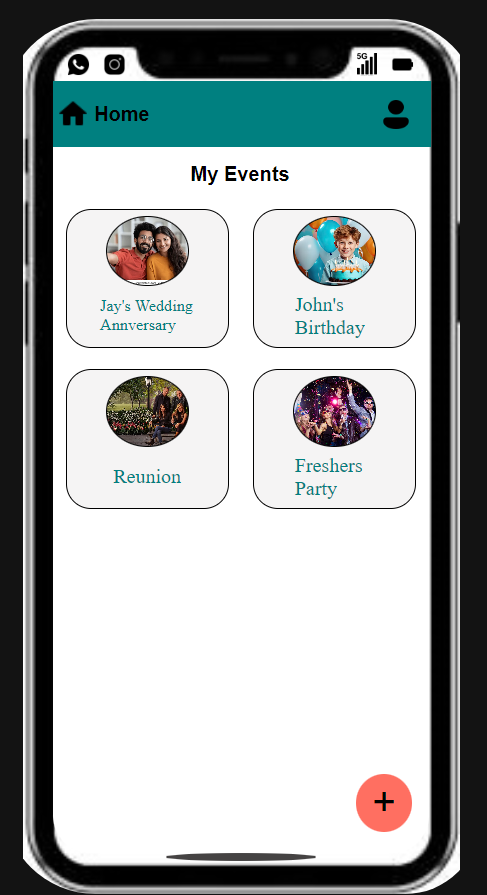
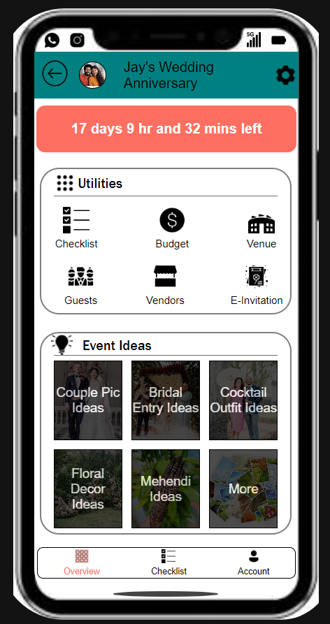
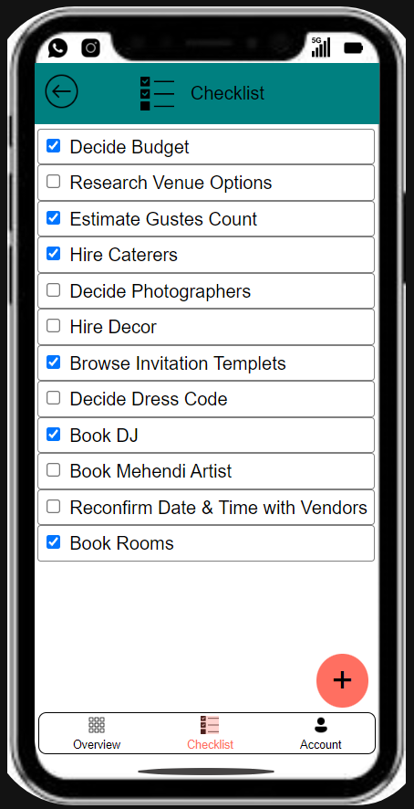
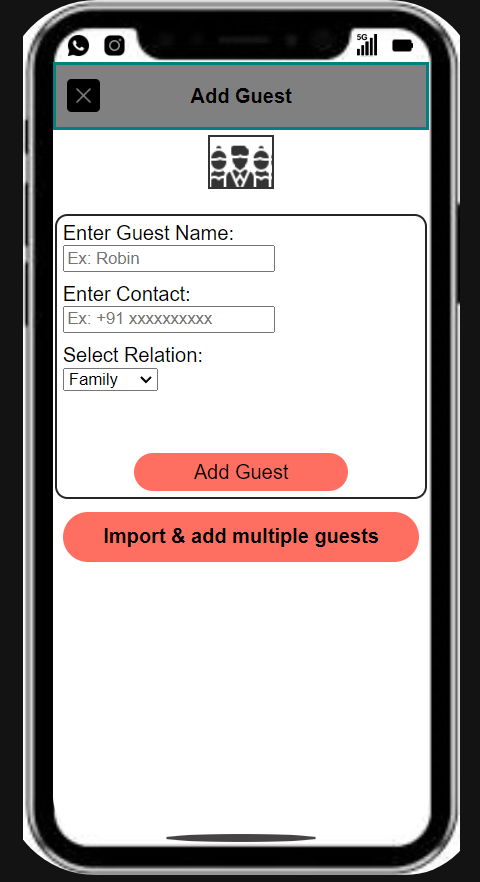
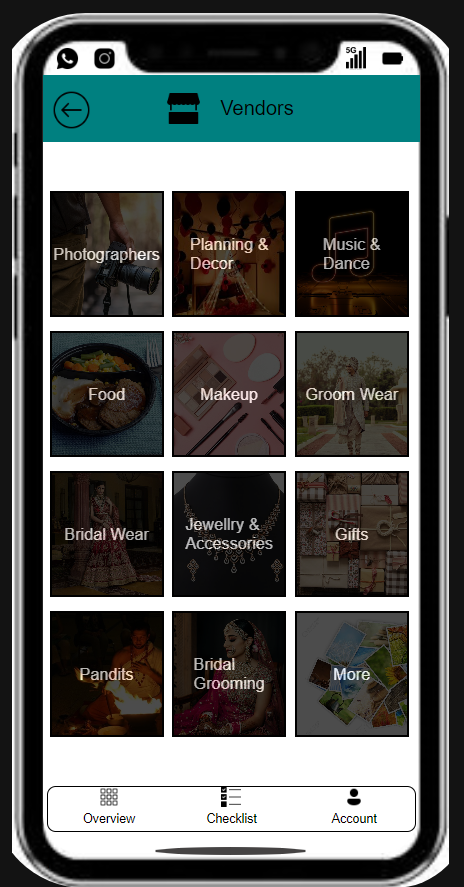
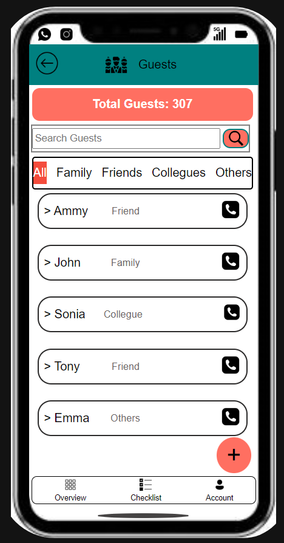
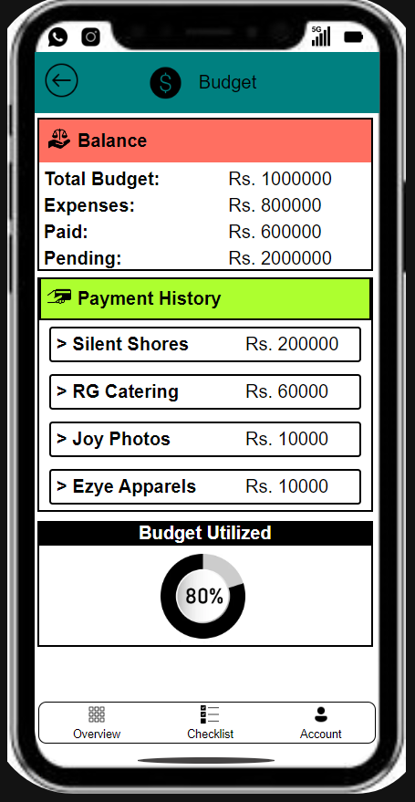

## Instructions

The [index.html](./index/index.html)file is in the index folder.  
Click on the **"EventEase"** icon on the home screen of the mobile to launch the app.  
Currently, only the **"Jay's Wedding"** option and the **"Add Events"** (red button at the bottom right corner of the first page of the app) are working.

## Contact Me

[Shubham's LinkedIn](https://www.linkedin.com/in/shubhamsingh3804?lipi=urn%3Ali%3Apage%3Ad_flagship3_profile_view_base_contact_details%3Bbjvf0RrmRsybYMeKzMPi5w%3D%3D).

# Images 

